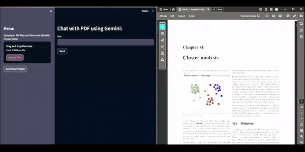

# Chat-with-PDF App README

## Overview
Hey there! I'm thrilled to share with you the "Chat-with-PDF" app - a cool project I've been working on to learn about the Gemini API, dive into vector databases using FAISS, and get an intro to Large Language Models (LLMs). Inspired by Krish Naik's video on Langchain and Google Gemini Pro, this app allows you to chat and fetch information from multiple PDFs at once!

## Features
- Chat interface to interact with the content of your PDF documents.
- PDF text extraction for chat context.
- FAISS vector database for efficient similarity search.
- Integration with Google's Gemini API for understanding and responding to queries.

## Motivation
The drive to learn and explore new technologies led me to this project. Understanding how the Gemini API can power up an app and how vector databases enhance search functionalities was an exciting challenge. Moreover, learning about LLMs and their application in real-world projects was an amazing experience.

## How to Run the App
1. Clone the repository.
2. Install the required packages from `requirements.txt` using `pip install -r requirements.txt`.
3. Set up your environment variables in a `.env` file with your Google API key as `GOOGLE_API_KEY`.
4. Run `streamlit run app.py` in your terminal.
5. Upload your PDFs and start chatting!

## Dependencies
- Streamlit
- Google Generative AI
- python-dotenv
- Langchain
- PyPDF2
- ChromaDB
- FAISS (CPU)
- Langchain Google GenAI

Check `requirements.txt` for the specific versions.

## Contributions
Feel free to fork, suggest improvements, or contribute to this enthusiastic learning journey. Every bit of help or suggestion is celebrated!

## Credits
A huge shoutout to [Krish Naik](https://github.com/krishnaik06) for the amazing tutorial. Your content is an inspiration and a fantastic learning resource!

Keep exploring! 🚀📚

## App Demo

()
